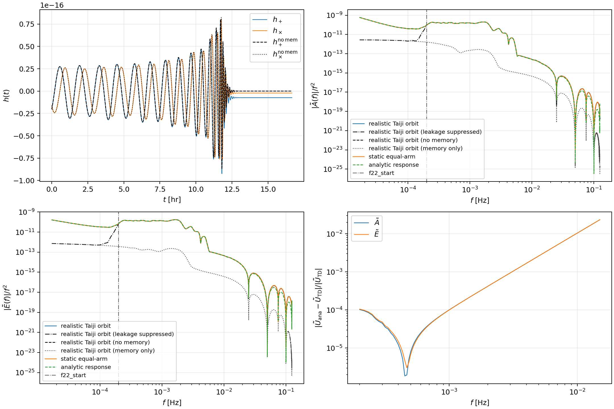
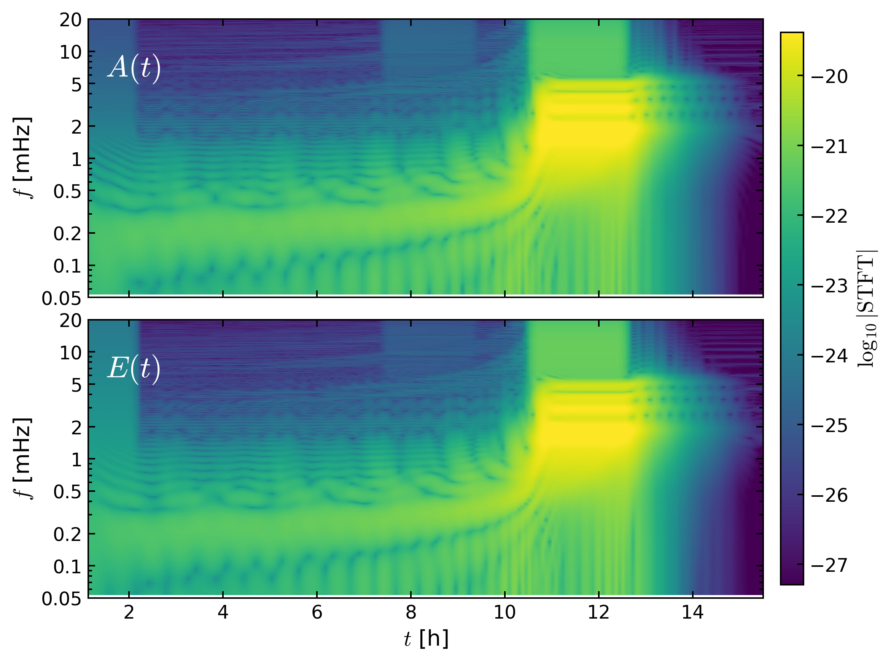
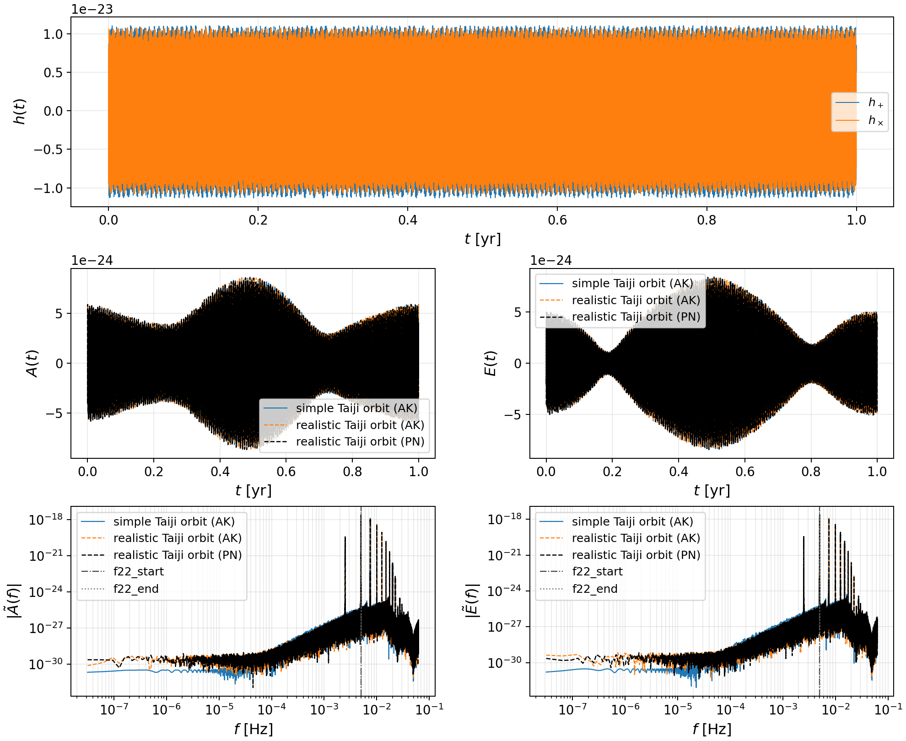
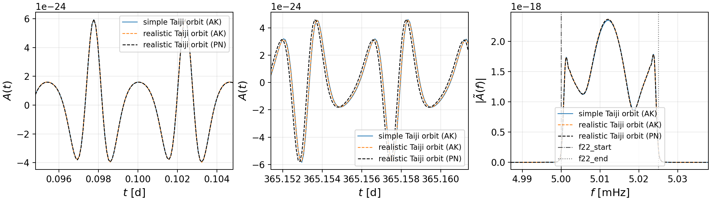

# GWDelta

<p align="center">
  
</p>

GWDelta is a toolkit for fast single-detector and detector-network response calculations for space-based gravitational-wave detectors, focusing on LISA-like triangular constellations.

The response code can run on CPU or through `force_backend="cuda12x"` with the modified `fastlisaresponse` fork [`cao-yan-phys/lisa-on-gpu`](https://github.com/cao-yan-phys/lisa-on-gpu) and `lisatools`.

## Example 1

The example below compares three Taiji response calculations for a precessing quasi-circular SMBHB waveform generated with `SEOBNRv5PHM` (including null displacement memory from all $l=2$ modes computed perturbatively):

- second-generation $A,E$ channels with a realistic Taiji orbit;
- second-generation $A,E$ channels with a static equal-arm orbit;
- an analytic static equal-arm frequency-domain response.



<p align="center">

</p>

## Example 2

The example below compares a one-year nonspinning eccentric comparable-mass compact-binary waveform generated with an analytic kludge (AK) model using two Taiji response calculations. A PN waveform aligned to the same initial conditions is included as a diagnostic reference.

Binary masses: $m_1=50M_\odot$ , $m_2=30M_\odot$ ; symmetric mass ratio: $\nu=0.234375$ ; luminosity distance: $100\mathrm{Mpc}$ ; eccentricity: $e_t=0.1$ ; frequency markers: f22_start $=5.000\mathrm{mHz}$ , f22_end $\simeq 5.025\mathrm{mHz}$ .

The parameters of the AK and PN models are matched initially. The PN model uses the 1PN QK parametrization and 3PN evolution equations for $x(t)$ and $e_t(t)$. The waveform amplitude includes only the Newtonian quadrupolar $h_{2,0}$ and $h_{2,\pm2}$ modes. In the AK model, the harmonic phase includes a cubic-in-time term, and the periastron-precession phase includes a quadratic-in-time term.






## Example 3

The script below computes the $A,E$-channel SNR of a monochromatic elliptically polarized source with time-domain TDI responses and the built-in instrumental-noise PSDs:

```bash
python examples/monochromatic_snr_time_domain.py --years 1 --frequency 0.003 --amplitude 1e-22 --detectors all --response-backend cuda12x
```

`--detectors all` uses the built-in simple/toy orbits for LISA, Taiji, TianQin, and BBO. The script prints one SNR per detector and writes a small JSON summary under `outputs/monochromatic_snr_time_domain/`.

The source model is $h_+(t)=h_0\cos(2\pi f_0 t+\phi_0)$ and $h_\times(t)=\epsilon h_0\cos(2\pi f_0 t+\phi_0+\delta_\times)$. Here `--ellipticity` is $\epsilon$, `--phase` is $\phi_0$, and `--cross-phase` is the relative phase $\delta_\times$ of $h_\times$ with respect to $h_+$. The default `--cross-phase -1.57079632679` gives the usual quadrature phase.

Common source and response options are:

```bash
python examples/monochromatic_snr_time_domain.py \
  --years 1 \
  --dt 30 \
  --f0 0.003 \
  --amplitude 1e-22 \
  --ellipticity 1.0 \
  --phase 0.0 \
  --cross-phase -1.57079632679 \
  --lam 0.3 \
  --beta 0.4 \
  --detectors lisa,taiji \
  --tdi-generation second \
  --response-backend cuda12x
```

The optional parameters are `--years`, `--dt`, `--frequency`/`--f0`, `--amplitude`, `--ellipticity`, `--phase`, `--cross-phase`, `--lam`, `--beta`, `--detectors`, `--tdi-generation`, `--response-backend`, `--order`, `--t-buffer`, `--trim-garbage`/`--no-trim-garbage`, `--orbit-dt`, `--orbit-margin-s`, `--orbit-config-json`, `--skip-unavailable`, `--output-json`, and `--no-output-json`.

For this script, each selected detector starts from the default initial configuration of its built-in orbit model at local `t=0`; the orbit then evolves for the requested observation time. The initial configuration can be changed with `--orbit-config-json`. The JSON object is keyed by detector name and uses the same parameter names as `OrbitSpec`, including degree aliases such as `center_phase_deg`, `cartwheel_phase_deg`, `plane_inclination_deg`, `normal_lon_deg`, and `normal_lat_deg`:

```json
{
  "lisa": {"center_phase_deg": -10.0, "cartwheel_phase_deg": 80.0},
  "taiji": {"center_phase_deg": 30.0, "cartwheel_phase_deg": -70.0},
  "tianqin": {"center_phase_deg": 5.0, "normal_lon_deg": 120.5, "normal_lat_deg": -4.7},
  "bbo": {"center_phase_deg": -30.0}
}
```

```bash
python examples/monochromatic_snr_time_domain.py --detectors all --orbit-config-json orbit_config.json
```

For direct network-response calculations from SSB-frame polarizations:

```python
from gwdelta import DetectorNetwork

net = DetectorNetwork("lisa,taiji,tianqin,bbo", force_backend="cuda12x")
response = net.compute_response(
    t,
    h_plus,
    h_cross,
    lam=0.3,
    beta=0.4,
    tdi_generation="second",
    tdi_chan="AE",
)

A_lisa = response["lisa"].channels["A"]
E_lisa = response["lisa"].channels["E"]
```

## Orbit Models and Data Sources

GWDelta can build FastLISAResponse-compatible orbit objects from the following `base` options:

| `base`            | Detector/orbit        | Source                                                       |
| ----------------- | --------------------- | ------------------------------------------------------------ |
| `lisa-simple`     | LISA simple equal-arm orbit | Built-in rigid heliocentric cartwheel model             |
| `taiji-simple`    | Taiji simple equal-arm orbit | Built-in rigid heliocentric cartwheel model             |
| `taiji-accurate`  | Taiji realistic orbit | `MicroSateOrbit.hdf5` from [`TriangleDataCenter/Triangle-Simulator/OrbitData/MicroSateOrbitEclipticTCB`](https://github.com/TriangleDataCenter/Triangle-Simulator/tree/main/OrbitData/MicroSateOrbitEclipticTCB) |
| `esa`             | LISA realistic orbit  | `ESAOrbits` from [`LISAanalysistools`](https://github.com/mikekatz04/LISAanalysistools) |
| `bbo-stage1-toy`  | BBO toy orbit         | Built-in rigid heliocentric toy model                        |
| `tianqin-toy`     | TianQin toy orbit     | Built-in rigid geocentric toy model                          |
| `file`            | User orbit            | Sampled NPZ/CSV orbit data                                   |

**Warning:** The Taiji orbit files use the reverse `1,2,3` spacecraft ordering from the analytic response formulas in this code; GWDelta relabels spacecraft `1` and `2` and the corresponding light-time links internally when building the analytic-comparison orbit.

GWDelta can also generate simple equal-arm orbits directly from a reference triangle in the realistic Taiji orbit. First build the realistic Taiji orbit and relabel it to the standard TDI convention, then interpolate the three spacecraft positions at `reference_time_s`.

The static helper builds a fixed equal-arm triangle with the same reference center, sets the effective arm length to the median reference arm length, and fits the analytic triangle orientation:

```python
from gwdelta import make_static_equal_arm_orbits_from_reference

simple_orbits, match = make_static_equal_arm_orbits_from_reference(
    reference_positions_m,
    duration_s=duration_s,
    reference_time_s=reference_time_s,
    center_at_reference=True,
    force_backend="cuda12x",
)
```

The dynamic helper matches the center, arm length, and analytic triangle orientation at `reference_time_s`, then lets the simple equal-arm orbit evolve with the same sidereal-year guiding-center phase:

```python
from gwdelta import make_dynamic_equal_arm_orbits_from_reference

simple_orbits, match = make_dynamic_equal_arm_orbits_from_reference(
    reference_positions_m,
    duration_s=duration_s,
    reference_time_s=reference_time_s,
    orbit_dt=600.0,
    force_backend="cuda12x",
)
```

The returned `match` records the reference positions, reference center, effective arm length, orientation parameters, guiding-center radius/phase, sampling cadence, and fit residual.

Orbit parameters can be changed through `make_orbits_from_spec`:

```python
from gwdelta import make_orbits_from_spec

orbits = make_orbits_from_spec(
    {
        "base": "taiji-accurate",
        "orbit_dir": "path/to/MicroSateOrbitEclipticTCB",
        "orbit_dt": 600.0,
        "time_offset": 0.0,
        "center_phase_deg": 20.0,
        "rotate_z_deg": 0.0,
        "translation_m": [0.0, 0.0, 0.0],
        "scale": 1.0,
    },
    duration=86400.0,
    force_backend="cpu",
)
```

Set `base` explicitly. The default values for the other optional orbit parameters are:

- `orbit_dt=600 s`;
- `time_offset=0`;
- `rotate_z_deg=0`;
- `translation_m=[0,0,0]`;
- `scale=1`;
- `armlength_m=None`, meaning use the source orbit value;
- `links=[12,23,31,13,32,21]`;
- `use_project_phase_defaults=True`.

Project phase defaults align LISA simple orbits to a center phase of `-20 deg` at local `t=0`, and Taiji simple/realistic orbits to `+20 deg`. Set `use_project_phase_defaults=False` to keep the raw orbit-file epoch.

Family-specific defaults:

- `lisa-simple`: `armlength_m=2.5e9`, guiding-center radius `1 AU`, center phase `-20 deg`, cartwheel period one sidereal year, cartwheel phase `90 deg`, detector-plane normal inclination `60 deg`.
- `taiji-simple`: `armlength_m=3.0e9`, guiding-center radius `1 AU`, center phase `+20 deg`, cartwheel period one sidereal year, cartwheel phase `-90 deg`, detector-plane normal inclination `60 deg`.
- `taiji-accurate`: arm length defaults to the median file light time times `c`.
- `bbo-stage1-toy`: `armlength_m=5.0e7`, guiding-center radius `1 AU`, center phase `-20 deg`, cartwheel period one sidereal year, cartwheel phase `90 deg`, detector-plane normal inclination `60 deg`; see [arXiv:gr-qc/0506015](https://arxiv.org/abs/gr-qc/0506015).
- `tianqin-toy`: geocentric radius `1.0e8 m`, arm length `sqrt(3) * 1.0e8 m`, guiding-center radius `1 AU`, fixed plane normal at longitude `120.5 deg` and latitude `-4.7 deg`; see [arXiv:2012.03260](https://arxiv.org/abs/2012.03260).

## TDI Options

The time-domain interface separates the TDI delay combination from the output channel basis:

- `tdi="1st generation"`: first-generation Michelson-style ordinary triplet; see [arXiv:gr-qc/0409034](https://arxiv.org/abs/gr-qc/0409034).
- `tdi="2nd generation"`: second-generation Michelson-style ordinary triplet; see [arXiv:gr-qc/0310017](https://arxiv.org/abs/gr-qc/0310017).
- `tdi="hybrid relay"`: hybrid Relay ordinary triplet; see [arXiv:2403.01490](https://arxiv.org/abs/2403.01490).
- `tdi=[...]`: a custom list of FastLISAResponse delay-term dictionaries.
- `tdi_chan="XYZ"`: return the three ordinary channels using the existing FastLISAResponse output names.
- `tdi_chan="AET"`: rotate the selected ordinary triplet to three optimal channels; see [arXiv:gr-qc/0209039](https://arxiv.org/abs/gr-qc/0209039).
- `tdi_chan="AE"`: return only the first two rotated channels.

Examples:

```python
from gwdelta import FastLISAResponseTDI

michelson = FastLISAResponseTDI(
    orbits=orbits,
    tdi="2nd generation",
    tdi_chan="AE",
)

hybrid_relay = FastLISAResponseTDI(
    orbits=orbits,
    tdi="hybrid relay",
    tdi_chan="AET",
)
```

The `tdi_chan` selector keeps the existing output naming convention. `XYZ` means the selected ordinary triplet before A/E/T rotation; the actual delay combination is selected by `tdi`.
