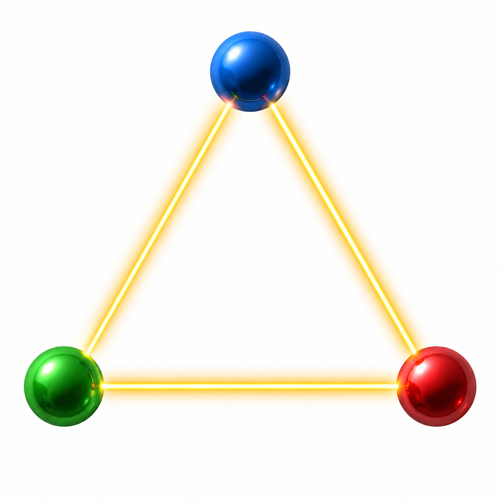
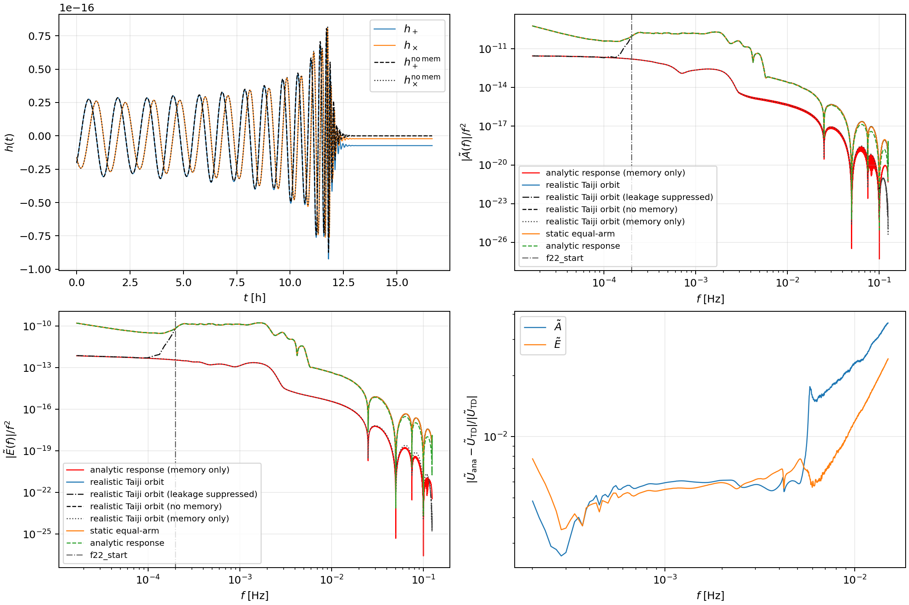
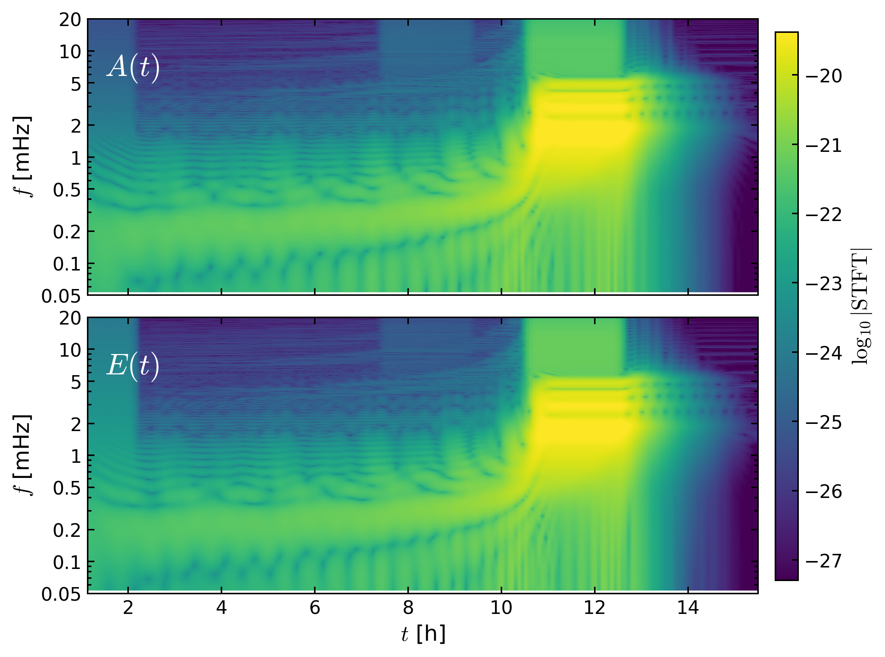
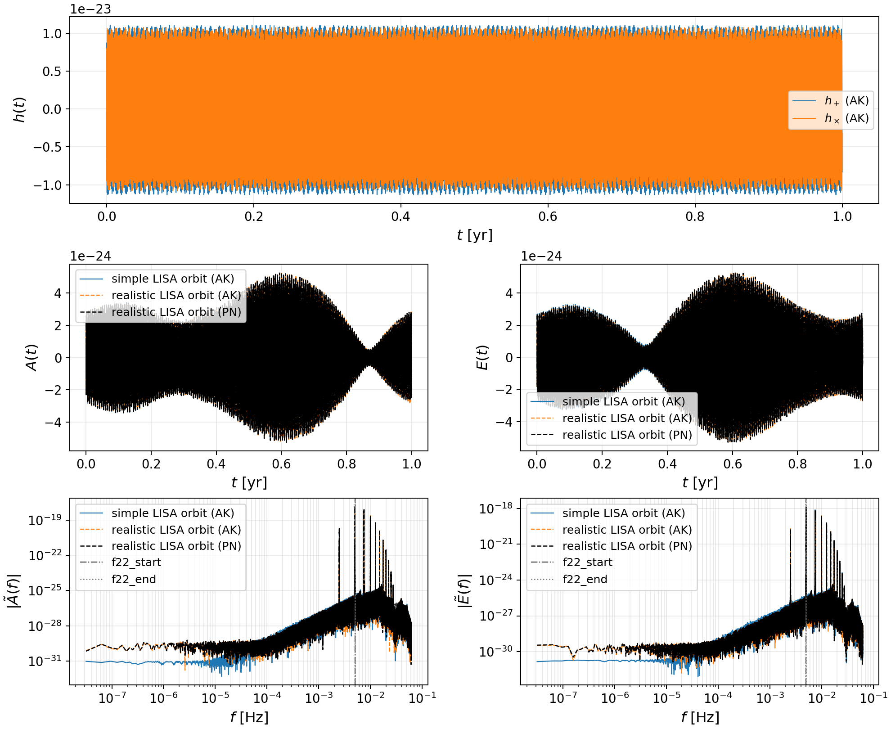
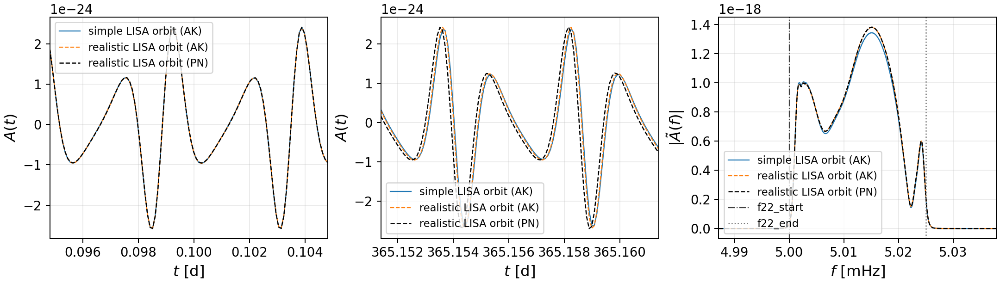
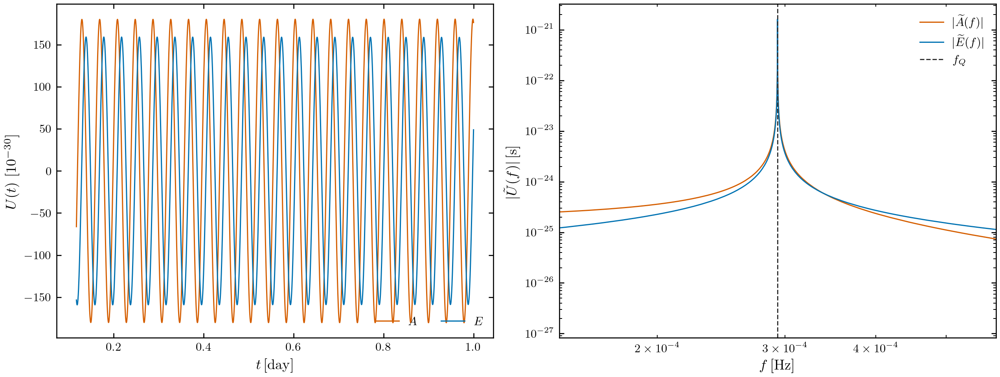
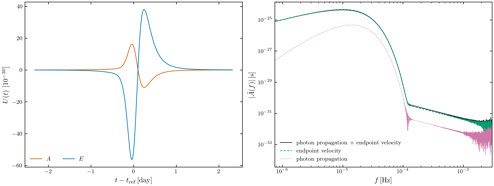
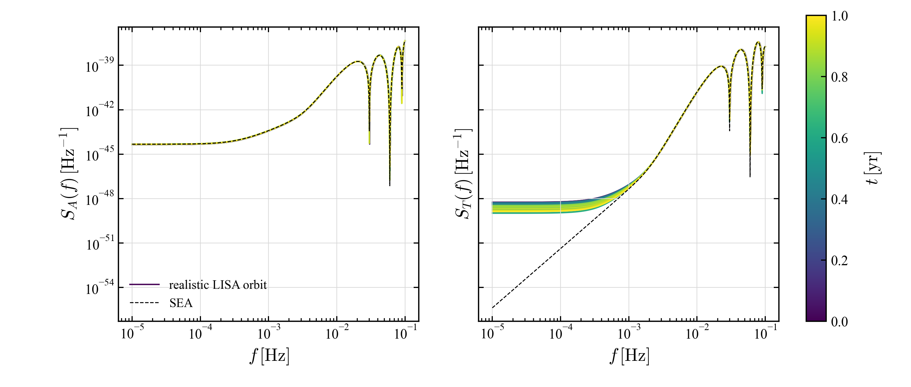

# GWDelta

<p align="center">
  
</p>

GWDelta is a toolkit for fast single-detector and detector-network response calculations for space-based gravitational-wave detectors, focusing on LISA-like triangular constellations.

The response code can run on CPU or through `force_backend="cuda12x"` with the modified `fastlisaresponse` fork [`cao-yan-phys/lisa-on-gpu`](https://github.com/cao-yan-phys/lisa-on-gpu) and `lisatools`.

Besides plane gravitational waves, GWDelta can also calculate TDI signals from general linear metric perturbations in the nonrelativistic test-mass approximation.

## Example 1

The example below compares three Taiji response calculations for a precessing quasi-circular SMBHB waveform generated with `SEOBNRv5PHM` (including null displacement memory from all $l=2$ modes computed perturbatively):

- second-generation $A,E$ channels with a realistic Taiji orbit;
- second-generation $A,E$ channels with a static equal-arm orbit;
- an analytic static equal-arm frequency-domain response.



<p align="center">

</p>

## Example 2

The example below compares a one-year nonspinning eccentric comparable-mass compact-binary waveform generated with an analytic kludge (AK) model using two LISA TDI2 response calculations. A PN waveform aligned to the same initial conditions is included as a diagnostic reference.

Binary masses: $m_1=50M_\odot$ , $m_2=30M_\odot$ ; symmetric mass ratio: $\nu=0.234375$ ; luminosity distance: $100\mathrm{Mpc}$ ; eccentricity: $e_t=0.1$ ; frequency markers: f22_start $=5.000\mathrm{mHz}$ , f22_end $\simeq 5.025\mathrm{mHz}$ .

The parameters of the AK and PN models are matched initially. The PN model uses the 1PN QK parametrization and 3PN evolution equations for $x(t)$ and $e_t(t)$. The waveform amplitude includes only the Newtonian quadrupolar $h_{2,0}$ and $h_{2,\pm2}$ modes. In the AK model, the harmonic phase includes a cubic-in-time term, and the periastron-precession phase includes a quadratic-in-time term.






## Example 3

The script below computes the $A,E$-channel SNR of a monochromatic elliptically polarized source with time-domain TDI2 responses and the built-in instrumental-noise PSDs:

```bash
python examples/monochromatic_snr_time_domain.py --years 1 --frequency 0.003 --amplitude 1e-22 --detectors all --response-backend cuda12x
```

`--detectors all` uses the built-in analytic orbit models for LISA, Taiji, TianQin, and BBO. The script prints one SNR per detector and writes a small JSON summary under `outputs/monochromatic_snr_time_domain/`.

The source model is $h_+(t)=h_0\cos(2\pi f_0 t+\phi_0)$ and $h_\times(t)=\epsilon h_0\cos(2\pi f_0 t+\phi_0+\delta_\times)$. Here `--ellipticity` is $\epsilon$, `--phase` is $\phi_0$, and `--cross-phase` is the relative phase $\delta_\times$ of $h_\times$ with respect to $h_+$. The default `--cross-phase -1.57079632679` gives the usual quadrature phase.

Common source and response options are:

```bash
python examples/monochromatic_snr_time_domain.py \
  --years 1 \
  --dt 30 \
  --f0 0.003 \
  --amplitude 1e-22 \
  --ellipticity 1.0 \
  --phase 0.0 \
  --cross-phase -1.57079632679 \
  --lam 0.3 \
  --beta 0.4 \
  --detectors lisa,taiji \
  --tdi-generation second \
  --response-backend cuda12x
```

The optional parameters are `--years`, `--dt`, `--frequency`/`--f0`, `--amplitude`, `--ellipticity`, `--phase`, `--cross-phase`, `--lam`, `--beta`, `--detectors`, `--tdi-generation`, `--response-backend`, `--order`, `--t-buffer`, `--trim-garbage`/`--no-trim-garbage`, `--orbit-dt`, `--orbit-margin-s`, `--orbit-config-json`, `--skip-unavailable`, `--output-json`, and `--no-output-json`.

For this script, each selected detector starts from the default initial configuration of its built-in orbit model at local `t=0`; the orbit then evolves for the requested observation time. The initial configuration can be changed with `--orbit-config-json`. The JSON object is keyed by detector name and uses the same parameter names as `OrbitSpec`, including degree aliases such as `center_phase_deg`, `cartwheel_phase_deg`, `plane_inclination_deg`, `normal_lon_deg`, and `normal_lat_deg`:

```json
{
  "lisa": {"center_phase_deg": -10.0, "cartwheel_phase_deg": 80.0},
  "taiji": {"center_phase_deg": 30.0, "cartwheel_phase_deg": -70.0},
  "tianqin": {"center_phase_deg": 5.0, "normal_lon_deg": 120.5, "normal_lat_deg": -4.7},
  "bbo": {"center_phase_deg": -30.0}
}
```

```bash
python examples/monochromatic_snr_time_domain.py --detectors all --orbit-config-json orbit_config.json
```

For direct network-response calculations from SSB-frame polarizations:

```python
from gwdelta import DetectorNetwork

net = DetectorNetwork("lisa,taiji,tianqin,bbo", force_backend="cuda12x")
response = net.compute_response(
    t,
    h_plus,
    h_cross,
    lam=0.3,
    beta=0.4,
    tdi_generation="second",
    tdi_chan="AE",
)

A_lisa = response["lisa"].channels["A"]
E_lisa = response["lisa"].channels["E"]
```

## Example 4

The example below computes the second-generation $A,E$ signals and one-year SNRs produced by a monochromatic $l=2,m=2$ component of the Sun's mass quadrupole moment with a realistic LISA orbit:

```bash
python examples/lisa_solar_quadrupole_snr_demo.py --years 1 --response-backend cuda12x --publish-figure
```

The source is the solar $l=2,m=2,n=-1$ g mode. The updated MESA GS98 model gives $f_Q=0.293\\,\mathrm{mHz}$, $J_2=5.38\times10^{-3}$, and $V_2=1.96\times10^5\\,\mathrm{m\\,s^{-1}}$ ([arXiv:2602.18385](https://arxiv.org/abs/2602.18385)). The model is nonrotating and retains a single $m=2$ component; rotational splitting and the associated pattern rotation are omitted. Solar $g$ modes remain undetected, and this example adopts a surface velocity amplitude of $0.1\\,\mathrm{mm\\,s^{-1}}$, as predicted in [arXiv:astro-ph/9512091](https://arxiv.org/abs/astro-ph/9512091). Later calculations give an upper prediction of $\lesssim0.3\\,\mathrm{mm\\,s^{-1}}$ ([arXiv:1210.5525](https://arxiv.org/abs/1210.5525)). The solar spin axis follows the [NASA SOHO convention](https://sohoftp.nascom.nasa.gov/sdb/soho/ancillary/). The calculation includes both photon propagation and the leading nonrelativistic test-mass motion, using the monochromatic forced solution.

For a one-year observation, the static equal-arm approximation to the second-generation LISA instrumental-noise PSD gives the SNRs $\rho_A=0.01043$, $\rho_E=0.01041$, and $\rho_{AE}\equiv(\rho_A^2+\rho_E^2)^{1/2}=0.01473$.



## Example 5

The example below computes the second-generation $A,E$ signals of a constant-velocity point mass with a realistic LISA orbit, separating the photon-propagation and endpoint-velocity contributions [warning: the perturbed orbit is not fully taken into account]:

```bash
python examples/lisa_constant_velocity_point_mass_demo.py --years 1 --response-backend cuda12x --publish-figure
```

The point mass has rest mass $M=5.03\times10^{-11}M_\odot$. At the reference time $t_{\mathrm{ref}}$, its velocity relative to the constellation center is half the speed of light in the $+z$ direction of the SSB frame, and its separation perpendicular to this velocity is $b=5\times10^{12}\\,\mathrm{m}$. The endpoint-velocity term is obtained by integrating the leading nonrelativistic test-mass acceleration along the prescribed LISA trajectories, with $\delta\mathbf V$ initialized to zero at the start of the integration grid.



## General Metric-Perturbation Response

GWDelta evaluates the leading one-way fractional-frequency response of prescribed spacecraft trajectories to a general linear metric perturbation. In SSB coordinates $(t,\mathbf x)$, write

$$
ds^2=-(1+2\Psi)dt^2+2\Xi_i\\,dt\\,dx^i
+(\delta_{ij}+H_{ij})dx^i dx^j.
$$

The following equations use geometric units. For a link emitted by spacecraft $j$ at $(t_{\mathrm{e}},\mathbf x_{\mathrm{e}})$ and received by spacecraft $i$ at $(t_{\mathrm{r}},\mathbf x_{\mathrm{r}})$, define

$$
L=|\mathbf x_{\mathrm{r}}-\mathbf x_{\mathrm{e}}|,\qquad
\hat{\mathbf{k}}=\frac{\mathbf x_{\mathrm{r}}-\mathbf x_{\mathrm{e}}}{L},\qquad
\mathcal P=\Psi-\hat{\mathbf{k}}_a\Xi_a-\frac12 \hat{\mathbf{k}}_a \hat{\mathbf{k}}_bH_{ab}.
$$

Along the unperturbed photon trajectory

$$
\mathbf x_\gamma(t)=\mathbf x_{\mathrm{e}}
+\frac{t-t_{\mathrm{e}}}{t_{\mathrm{r}}-t_{\mathrm{e}}}
(\mathbf x_{\mathrm{r}}-\mathbf x_{\mathrm{e}}),
$$

the one-way fractional-frequency shift is

$$
y_{i\leftarrow j}=\Psi_{\mathrm{e}}-\Psi_{\mathrm{r}}
+\int_{t_{\mathrm{e}}}^{t_{\mathrm{r}}}
\partial_t\mathcal P[t,\mathbf x_\gamma(t);\hat{\mathbf{k}}]\\,dt
-\hat{\mathbf{k}}\cdot
(\delta\mathbf V_{\mathrm{r}}-\delta\mathbf V_{\mathrm{e}}).
$$

Here $\Psi_{\mathrm{e}}=\Psi(t_{\mathrm{e}},\mathbf x_{\mathrm{e}})$ and $\Psi_{\mathrm{r}}=\Psi(t_{\mathrm{r}},\mathbf x_{\mathrm{r}})$, while $\delta\mathbf V_{\mathrm{e}}$ and $\delta\mathbf V_{\mathrm{r}}$ are the metric-induced velocity perturbations of the emitter and receiver. Velocity-dependent terms are omitted, including the endpoint-displacement and photon-direction boundary-condition terms. GWDelta evaluates this response for any field supplied through `metric()` and `time_derivative()`. Link `ij` is received at `i` after emission from `j`; the link order is `12,23,31,13,32,21`.

For the optional endpoint term, test mass $A$ follows the leading nonrelativistic equation on its prescribed background trajectory $\mathbf x_A^{(0)}(t)$, retaining only velocity-independent terms:

$$
\frac{d\\,\delta V_A^i}{dt}
=-\partial_i\Psi\bigl[t,\mathbf x_A^{(0)}(t)\bigr]
-\partial_t\Xi_i\bigl[t,\mathbf x_A^{(0)}(t)\bigr],
\qquad
\frac{d\\,\delta x_A^i}{dt}=\delta V_A^i .
$$

`integrate_test_mass_motion()` integrates these equations with $\delta\mathbf V_A=\delta\mathbf x_A=0$ at the first sample. `RetardedQuadrupoleMode.steady_state_test_mass_motion()` instead uses the monochromatic forced solution.

The following metric models are built in:

### `RetardedQuadrupoleMode`

For a source at $\mathbf x_{\mathrm{s}}$, define $\mathbf R=\mathbf x-\mathbf x_{\mathrm{s}}$, $R=|\mathbf R|$, $\mathbf n=\mathbf R/R$, and $u=t-R$. The real STF quadrupole is $I_{ab}(u)=\mathrm{Re}\\!\left(\mathcal I_{ab}e^{-i\omega_Q u}\right)$, where $\mathcal I_{ab}$ is its complex STF amplitude, $\omega_Q=2\pi f_Q$, and dots denote derivatives with respect to $u$.

$$
\begin{aligned}
h^Q_{00}&=n_an_b
\left(\frac{3I_{ab}}{R^3}+\frac{3\dot I_{ab}}{R^2}
+\frac{\ddot I_{ab}}{R}\right),\\
\Psi_Q&=-\frac12h^Q_{00},\\
\Xi^Q_a&=-2n_b
\left(\frac{\dot I_{ab}}{R^2}+\frac{\ddot I_{ab}}{R}\right),\\
H^Q_{ab}&=h^Q_{00}\delta_{ab}+\frac{2}{R}\ddot I_{ab}.
\end{aligned}
$$

The $R^{-3}$, $R^{-2}$, and $R^{-1}$ contributions are, respectively, the near-, intermediate-, and radiation-zone parts of the first-post-Minkowskian quadrupole metric ([arXiv:gr-qc/0603064](https://arxiv.org/abs/gr-qc/0603064)).

`steady_state_test_mass_motion()` evaluates the leading nonrelativistic test-mass motion driven by $I_{ab}(u)$ defined above, using the steady-state forced solution; general time-dependent fields can be handled by `integrate_test_mass_motion()`.

### `SmoothVaidyaMassLoss`

`SmoothVaidyaMassLoss` is the perturbation relative to the pre-loss static field of the outgoing Vaidya spacetime for spherical null radiation ([Vaidya 1951](https://doi.org/10.1007/BF03173260); [Lindquist, Schwartz, and Misner 1965](https://doi.org/10.1103/PhysRev.137.B1364)). With $\mathbf x_{\mathrm{s}}$ its origin, define $\mathbf R=\mathbf x-\mathbf x_{\mathrm{s}}$, $R=|\mathbf R|$, $\mathbf n=\mathbf R/R$, and $u=t-R$. For $\Delta M>0$,

$$
F(u)=\frac{1+\tanh[(u-u_0)/\tau]}{2},\qquad
\mathcal U_\Delta=\frac{\Delta M}{R}F(u),
$$

where $u_0$ and $\tau>0$ set the transition time and width. Relative to the pre-loss static metric,

$$
\delta\Psi=\mathcal U_\Delta,\qquad
\delta\Xi_a=2\mathcal U_\Delta n_a,\qquad
\delta H_{ab}=-2\mathcal U_\Delta n_an_b.
$$

`acceleration()` and `integrate_test_mass_motion()` provide the same leading nonrelativistic fixed-background endpoint motion used by the other templates.

### `ConstantVelocityPointMass`

For a particle of rest mass $M$, let $\mathbf z_{\mathrm{ref}}$ be its position at $t_{\mathrm{ref}}$ and $\mathbf v$ its constant SSB velocity:

$$
\mathbf z(t)=\mathbf z_{\mathrm{ref}}+\mathbf v(t-t_{\mathrm{ref}}),\qquad
\mathbf R=\mathbf x-\mathbf z(t),\qquad R=|\mathbf R|.
$$

Define $\boldsymbol\beta=\mathbf v$, $\beta^2=\boldsymbol\beta\cdot\boldsymbol\beta$, and $\gamma=(1-\beta^2)^{-1/2}$, with

$$
\rho^2=R^2+\gamma^2(\boldsymbol\beta\cdot\mathbf R)^2,\qquad
\phi=\frac{M}{\rho}.
$$

At first post-Minkowskian order in harmonic coordinates,

$$
\Psi=-(2\gamma^2-1)\phi,\qquad
\Xi_a=-4\gamma^2\beta_a\phi,\qquad
H_{ab}=2\phi(\delta_{ab}+2\gamma^2\beta_a\beta_b).
$$

The photon-propagation term is evaluated analytically and is exact in $\beta$ for any subluminal particle speed ([arXiv:gr-qc/9902030](https://arxiv.org/abs/gr-qc/9902030)). `integrate_test_mass_motion()` computes the leading nonrelativistic endpoint-velocity perturbation along prescribed background trajectories.

## Plane-GW Polarizations

For a null plane-wave spatial metric perturbation (in the synchronous gauge) $h_{ij}=\sum_A h_A e^A_{ij}$, `lam` and `beta` are respectively the ecliptic longitude and latitude of the source direction $-\hat{\mathbf k}$ in the SSB frame. `sky_basis(lam, beta)` returns the right-handed orthonormal triad $(\hat{\mathbf k},\mathbf a,\mathbf b)$. `polarization_tensors(lam, beta)` constructs the six polarization tensors in the $E(2)$ classification of [Eardley et al. (1973)](https://doi.org/10.1103/PhysRevLett.30.884):

$$
\begin{aligned}
e^{+} &= \mathbf a\otimes\mathbf a-\mathbf b\otimes\mathbf b,
& e^{\times} &= \mathbf a\otimes\mathbf b+\mathbf b\otimes\mathbf a \\
e^{x} &= \mathbf a\otimes\hat{\mathbf k}+\hat{\mathbf k}\otimes\mathbf a,
& e^{y} &= \mathbf b\otimes\hat{\mathbf k}+\hat{\mathbf k}\otimes\mathbf b \\
e^{b} &= \mathbf a\otimes\mathbf a+\mathbf b\otimes\mathbf b,
& e^{l} &= \sqrt{2}\hat{\mathbf k}\otimes\hat{\mathbf k}.
\end{aligned}
$$

They satisfy $e^A_{ij} e^B_{ij}=2\delta^{AB}$. In the static equal-arm approximation, `link_fd_polarization_response()` returns the six one-link frequency-domain response functions $R^A_{ij}(f)$. Pass a nonempty mapping of spectra, keyed by `plus`, `cross`, `vector_x`, `vector_y`, `breathing`, and `longitudinal`, to `StaticTaijiFDResponse.xyz_polarizations()`, `.aet_polarizations()`, or `.ae_polarizations()` to obtain the corresponding response. For a prescribed orbit, `FastLISAResponseTDI.compute_polarizations()` takes a mapping of sampled time-domain strains under one or more of the six keys above, constructs the associated tensors internally, and returns the TDI response. The `source_time_s` grid must cover all retarded SSB times evaluated along the links.

## Orbit Models and Data Sources

GWDelta can build FastLISAResponse-compatible orbit objects from the following `base` options:

| `base`            | Detector/orbit        | Source                                                       |
| ----------------- | --------------------- | ------------------------------------------------------------ |
| `lisa-simple`     | LISA simple equal-arm orbit | Built-in rigid heliocentric cartwheel model             |
| `taiji-simple`    | Taiji simple equal-arm orbit | Built-in rigid heliocentric cartwheel model             |
| `taiji-accurate`  | Taiji numerical orbit | `MicroSateOrbit.hdf5` from [`TriangleDataCenter/Triangle-Simulator/OrbitData/MicroSateOrbitEclipticTCB`](https://github.com/TriangleDataCenter/Triangle-Simulator/tree/main/OrbitData/MicroSateOrbitEclipticTCB) (covers 114 days) |
| `esa`             | LISA numerical orbit  | `ESAOrbits` from [`LISAanalysistools`](https://github.com/mikekatz04/LISAanalysistools) |
| `bbo-stage1-toy`  | BBO Stage 1 orbit     | Built-in rigid heliocentric cartwheel model                  |
| `tianqin-toy`     | TianQin orbit         | Built-in rigid geocentric cartwheel model                     |
| `file`            | User orbit            | Sampled NPZ/CSV orbit data                                   |

**Warning:** The Taiji orbit files use the reverse `1,2,3` spacecraft ordering from the analytic response formulas in this code; GWDelta relabels spacecraft `1` and `2` and the corresponding light-time links internally when building the analytic-comparison orbit.

GWDelta can also generate simple equal-arm orbits directly from a reference triangle in the realistic Taiji orbit. First build the realistic Taiji orbit and relabel it to the standard TDI convention, then interpolate the three spacecraft positions at `reference_time_s`.

The static helper builds a fixed equal-arm triangle with the same reference center, sets the effective arm length to the median reference arm length, and fits the analytic triangle orientation:

```python
from gwdelta import make_static_equal_arm_orbits_from_reference

simple_orbits, match = make_static_equal_arm_orbits_from_reference(
    reference_positions_m,
    duration_s=duration_s,
    reference_time_s=reference_time_s,
    center_at_reference=True,
    force_backend="cuda12x",
)
```

The dynamic helper matches the center, arm length, and analytic triangle orientation at `reference_time_s`, then lets the simple equal-arm orbit evolve with the same sidereal-year guiding-center phase:

```python
from gwdelta import make_dynamic_equal_arm_orbits_from_reference

simple_orbits, match = make_dynamic_equal_arm_orbits_from_reference(
    reference_positions_m,
    duration_s=duration_s,
    reference_time_s=reference_time_s,
    orbit_dt=600.0,
    force_backend="cuda12x",
)
```

The returned `match` records the reference positions, reference center, effective arm length, orientation parameters, guiding-center radius/phase, sampling cadence, and fit residual.

Orbit parameters can be changed through `make_orbits_from_spec`:

```python
from gwdelta import make_orbits_from_spec

orbits = make_orbits_from_spec(
    {
        "base": "taiji-accurate",
        "orbit_dir": "path/to/MicroSateOrbitEclipticTCB",
        "orbit_dt": 600.0,
        "time_offset": 0.0,
        "center_phase_deg": 20.0,
        "rotate_z_deg": 0.0,
        "translation_m": [0.0, 0.0, 0.0],
        "scale": 1.0,
    },
    duration=86400.0,
    force_backend="cpu",
)
```

Set `base` explicitly. The default values for the other optional orbit parameters are:

- `orbit_dt=600 s`;
- `time_offset=0`;
- `rotate_z_deg=0`;
- `translation_m=[0,0,0]`;
- `scale=1`;
- `armlength_m=None`, meaning use the source orbit value;
- `links=[12,23,31,13,32,21]`;
- `use_project_phase_defaults=True`.

Project phase defaults align LISA simple orbits to a center phase of `-20 deg` at local `t=0`, and Taiji simple/realistic orbits to `+20 deg`. Set `use_project_phase_defaults=False` to keep the raw orbit-file epoch.

Family-specific defaults:

- `lisa-simple`: `armlength_m=2.5e9`, guiding-center radius `1 AU`, center phase `-20 deg`, cartwheel period one sidereal year, cartwheel phase `90 deg`, detector-plane normal inclination `60 deg`.
- `taiji-simple`: `armlength_m=3.0e9`, guiding-center radius `1 AU`, center phase `+20 deg`, cartwheel period one sidereal year, cartwheel phase `-90 deg`, detector-plane normal inclination `60 deg`.
- `bbo-stage1-toy`: `armlength_m=5.0e7`, guiding-center radius `1 AU`, center phase `-20 deg`, cartwheel period one sidereal year, cartwheel phase `90 deg`, detector-plane normal inclination `60 deg`; see [arXiv:gr-qc/0506015](https://arxiv.org/abs/gr-qc/0506015).
- `tianqin-toy`: geocentric radius `1.0e8 m`, arm length `sqrt(3) * 1.0e8 m`, guiding-center radius `1 AU`, fixed plane normal at longitude `120.5 deg` and latitude `-4.7 deg`; see [arXiv:2012.03260](https://arxiv.org/abs/2012.03260).

## TDI Options

The time-domain interface separates the TDI delay combination from the output channel basis:

- `tdi="1st generation"`: first-generation Michelson-style ordinary triplet; see [arXiv:gr-qc/0409034](https://arxiv.org/abs/gr-qc/0409034).
- `tdi="2nd generation"`: second-generation Michelson-style ordinary triplet; see [arXiv:gr-qc/0310017](https://arxiv.org/abs/gr-qc/0310017).
- `tdi="hybrid relay"`: second-generation hybrid Relay ordinary triplet; see [arXiv:2403.01490](https://arxiv.org/abs/2403.01490).
- `tdi=[...]`: a custom list of FastLISAResponse delay-term dictionaries.
- `tdi_chan="XYZ"`: return the three ordinary channels using the existing FastLISAResponse output names.
- `tdi_chan="AET"`: rotate the selected ordinary triplet to three optimal channels; see [arXiv:gr-qc/0209039](https://arxiv.org/abs/gr-qc/0209039).
- `tdi_chan="AE"`: return only the first two rotated channels.

Examples:

```python
from gwdelta import FastLISAResponseTDI

michelson = FastLISAResponseTDI(
    orbits=orbits,
    tdi="2nd generation",
    tdi_chan="AE",
)

hybrid_relay = FastLISAResponseTDI(
    orbits=orbits,
    tdi="hybrid relay",
    tdi_chan="AET",
)
```

The `tdi_chan` selector keeps the existing output naming convention. `XYZ` means the selected ordinary triplet before A/E/T rotation; the actual delay combination is selected by `tdi`.

For static equal-arm models, `gwdelta.noise` provides one-way instrumental-noise PSDs, TDI1/TDI2 A/E/T PSDs, and their diagonal inverse covariance. For static unequal arms, `gwdelta.tdi_noise` provides full TDI2 instrumental-noise CSDs in the `XYZ` or `AET` basis through `frozen_tdi2_noise_covariance()`.

The colored curves use 25 frozen epochs of the ESA numerical LISA orbit over one sidereal year; the black dashed curves show the static equal-arm (SEA) TDI2 PSD.


